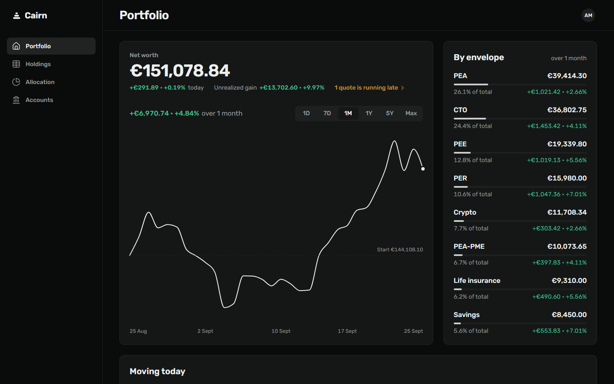
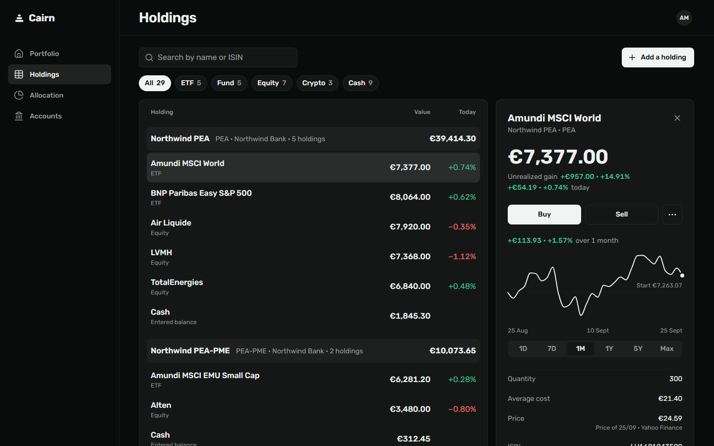
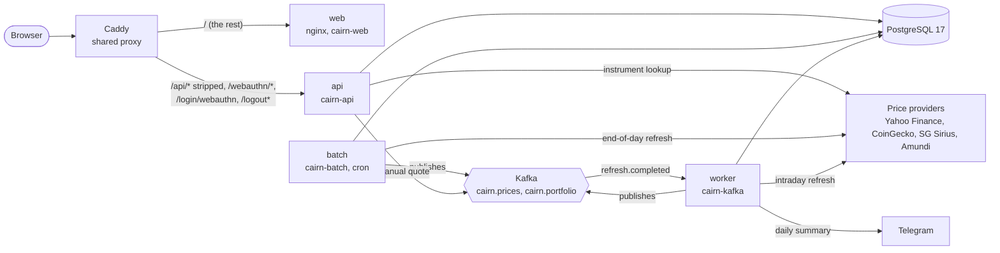

<p align="center">
  <picture>
    <source media="(prefers-color-scheme: dark)" srcset="docs/github/banner-dark.png">
    
  </picture>
</p>

<br>

<p align="center">
  <a href="https://github.com/JoanRoucoux/cairn/actions/workflows/ci.yml"></a>
  <a href="https://github.com/JoanRoucoux/cairn/actions/workflows/deploy.yml"></a>
  <a href="https://github.com/JoanRoucoux/cairn/releases/latest"></a>
  <a href="LICENSE"></a>
</p>

Cairn is a single-owner wealth tracker. Every envelope (PEA, PEA-PME, CTO, PER, PEE, life insurance, savings, crypto) is valued line by line, from Yahoo Finance, CoinGecko, SG Sirius, Amundi or a manual quote. A private instance runs at https://cairn.joanroucoux.fr behind passkey sign-in. This repository is the backend; the frontend and the design system live in their own repositories (see [The Cairn repositories](#the-cairn-repositories)).

## Screenshots

The data shown is fictional.

<p align="center">
  
</p>

<table>
  <tr>
    <td width="50%"></td>
    <td width="50%"></td>
  </tr>
</table>

<p align="center">
  
  
  
</p>

## Features

- **Dashboard**: net worth, day change, unrealized gain, and performance over 1D, 7D, 1M, 1Y, 5Y and max. 5Y and max are rebuilt at constant composition: today's holdings repriced over past quotes.
- **Allocation** by asset class and by account.
- **Holdings**: buy and sell, cash balance per account, manual quotes, and change of listing (`PUT /holdings/{id}/instrument`).
- **Instruments**: lookup by ISIN through Yahoo Finance and Amundi, with prices from Yahoo Finance, CoinGecko, SG Sirius, Amundi or entered by hand.
- **CSV import and export**: the import is all or nothing and reports errors as codes, never sentences. See [docs/portfolio-import.md](docs/portfolio-import.md).
- **Quote refresh**: an intraday refresh every 15 minutes (EQUITY and ETF on weekdays during market hours, CRYPTO around the clock) by the worker, and end-of-day batch jobs for equities, ETFs and funds.
- **Daily snapshots** of the measured portfolio value, at 23:30 Paris time.
- **Telegram summary** on weekdays at 19:45 Paris time: net worth, day change and each envelope's change.
- **Passkeys** (WebAuthn) with a password fallback, sessions stored in PostgreSQL.
- **Stale-quote detection**: a holding is flagged when its latest quote is older than its asset class allows.

## Architecture



The API calls the providers only to look an instrument up (ISIN or ticker) when one is created. The batch jobs and the worker refresh quotes, and which provider answers depends on the instrument's price source. The batch jobs and the worker publish after a refresh. The API publishes only when a quote is entered by hand: a `price.updated` on `cairn.prices` and a `refresh.completed` with the `MANUAL` trigger on `cairn.portfolio`. The worker consumes `refresh.completed` from `cairn.portfolio` to record a valuation point, so a manual quote gets one too.

### Modules

There is no parent pom: the root `pom.xml` only aggregates, and each module is a standalone Maven project that carries its own dependencies and quality plugins.

| Module | Role | Depends on |
| ------ | ---- | ---------- |
| `cairn-domain` | Model, exceptions, inbound and outbound ports, services. Plain Java. | nothing (JDK only) |
| `cairn-adapter` | Outbound adapters: price providers, Telegram, Kafka publishing, JPA persistence. | `cairn-domain` (compile) |
| `cairn-api` | REST application, generated from the OpenAPI contract, WebAuthn security. | `cairn-domain` (compile), `cairn-adapter` (runtime), `cairn-schema` (test) |
| `cairn-batch` | Spring Batch application: quote refresh, snapshot and backfill jobs. | `cairn-domain` (compile), `cairn-adapter` (runtime), `cairn-schema` (test) |
| `cairn-kafka` | Worker: topic declaration, intraday refresh scheduler, valuation consumer, Telegram summary. | `cairn-domain` (compile), `cairn-adapter` (runtime), `cairn-schema` (test) |
| `cairn-schema` | Liquibase changelogs only, no Java. | nothing |

Dependency rules:

- `cairn-domain` has zero compile-scope dependencies, a Maven guarantee and not just a convention.
- The application modules depend on `cairn-adapter` at runtime scope only: adapters are wired into the context but invisible at compile time.
- `cairn-schema` is applied out-of-band by ops or the pipeline, never by a running application, and the application modules depend on it at test scope only, to migrate their throwaway Testcontainers databases.
- ArchUnit tests enforce the hexagon on every build.

## The Cairn repositories

| Repository | Content |
| ---------- | ------- |
| [cairn](https://github.com/JoanRoucoux/cairn) (this one) | Backend: API, batch jobs, Kafka worker, schema |
| [cairn-web](https://github.com/JoanRoucoux/cairn-web) | Angular 22 frontend |
| [cairn-ui](https://github.com/JoanRoucoux/cairn-ui) | Design system, published on npm as `@joanroucoux/cairn-ui`, with a [Storybook](https://joanroucoux.github.io/cairn-ui/) |

The host, the shared proxy and the monitoring are managed in a separate, private infrastructure repository.

## Tech stack

| Tool | Version | Role |
| ---- | ------- | ---- |
| Java | 25 | Language and runtime |
| Spring Boot | 4.1.1 | Application framework |
| Spring Security WebAuthn, Spring Session JDBC | managed by Spring Boot | Passkey sign-in, sessions stored in PostgreSQL |
| Spring Batch | managed by Spring Boot | Scheduled quote and snapshot jobs |
| Spring for Apache Kafka | managed by Spring Boot | Event publishing and consumption |
| Apache Kafka | 4.3 (KRaft, no ZooKeeper) | Event broker (`apache/kafka:4.3.1`) |
| PostgreSQL | 17 (`postgres:17.11`) | Persistence |
| Liquibase | managed by Spring Boot | Versioned schema, applied out-of-band |
| openapi-generator | 7.25.0 | Contract-first interfaces and DTOs |
| springdoc | 3.1.1 | Swagger UI, `local` profile only |
| Testcontainers | 1.21.4 | PostgreSQL and Kafka in integration tests |
| WireMock | 3.13.2 | Tests of the price provider clients |
| ArchUnit | 1.5.0 | Architecture enforcement |
| Cucumber | 7.34.8 | Business scenarios over real HTTP |
| JaCoCo | 0.8.15 | Coverage gate |
| Spotless with palantir-java-format | 3.10.2 with 2.96.0 | Formatting |
| Docker, GHCR | | Images `cairn-api`, `cairn-schema`, `cairn-batch`, `cairn-kafka` |

## Quality and delivery

- **Contract-first**: `cairn-api/openapi/openapi.yaml` is edited first, and the build generates the interfaces and DTOs from it.
- **Test layers**: unit tests (`*Test`), integration tests with Testcontainers (`*IT`), Cucumber scenarios over real HTTP, ArchUnit rules, and a JaCoCo gate of 70 % of lines per module.
- **Nightly contract check**: a scheduled workflow runs the `external` tests against the real price providers and opens an issue when they fail.
- **Continuous deployment**: every push to `main` runs CI, builds the images tagged `sha-xxxxxxx`, applies the Liquibase migration before anything starts, brings the stack up and checks the health endpoint.
- **Releases**: a successful deploy publishes a CalVer release `vYYYY.MM.DD.n`, with notes generated by git-cliff.
- **Dependabot** keeps Maven, GitHub Actions, Docker and Docker Compose dependencies up to date.
- **Monitoring**: each scheduled job pings an Uptime Kuma push monitor. See [docs/operations.md](docs/operations.md).

## Getting started

Prerequisites: JDK 25 and Docker.

```bash
./mvnw verify
./mvnw spring-boot:run -pl cairn-api -Dspring-boot.run.profiles=local
```

The second command starts PostgreSQL and applies the schema through Docker Compose, then serves the API on `http://localhost:8080` with authentication off. See [docs/development.md](docs/development.md) for the rest.

## Documentation

- [docs/development.md](docs/development.md): local run, Docker Compose, Kafka, contract-first workflow, testing, conventions
- [docs/operations.md](docs/operations.md): production layout, deployment by hand, push monitors, backfilling quotes, Telegram summary
- [docs/portfolio-import.md](docs/portfolio-import.md): CSV import and export
- [AGENTS.md](AGENTS.md): architecture, conventions and gotchas, for contributors and coding agents

## License

[MIT](LICENSE)

<sub>Generated from [java-starter](https://github.com/JoanRoucoux/java-starter).</sub>
